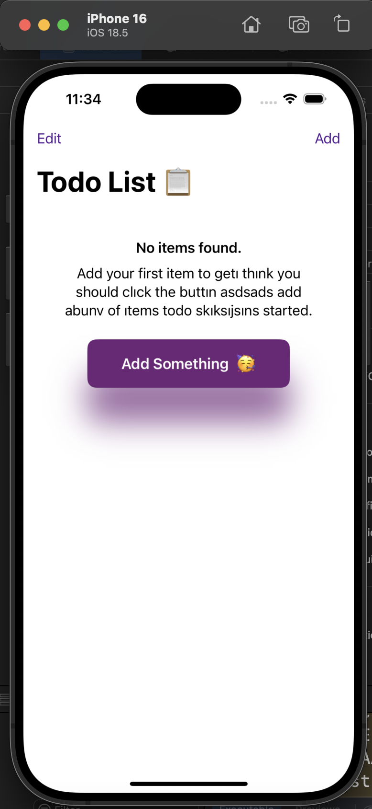
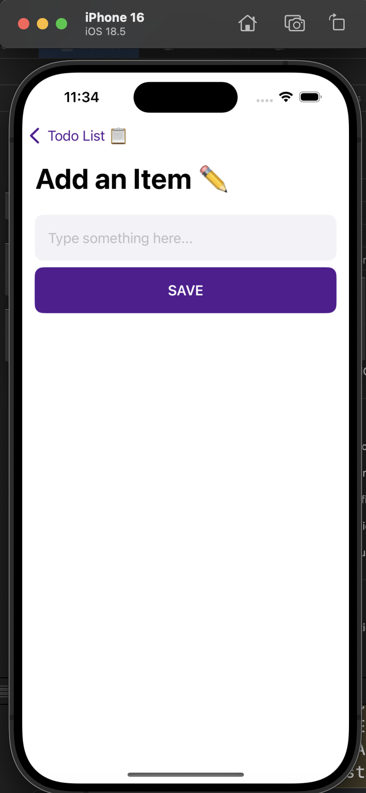
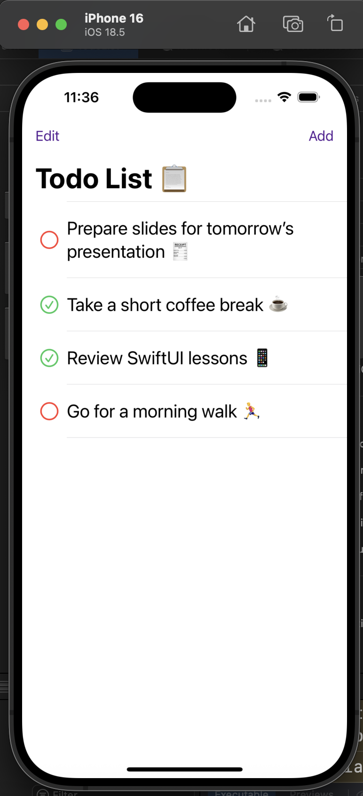

# ✅ TodoList App

A simple To-Do List application built with **SwiftUI**, following the **MVVM architecture** pattern.  
Users can add, delete, and mark tasks as completed.  
All data is stored persistently using `UserDefaults`.

---

## 🚀 Features
- Add, delete, and complete tasks  
- Persistent data storage with UserDefaults  
- Clean MVVM architecture  
- Modern and minimal SwiftUI interface  

---

## 🛠️ Technologies
- Swift  
- SwiftUI  
- MVVM  
- UserDefaults  

---

## 📸 Screenshots

  
  
  

---

## 👨‍💻 Author
**Harun Naçar**  
[GitHub Profile](https://github.com/harunnacar24)

---

## 📄 License
This project is open source and available under the [MIT License](LICENSE).
